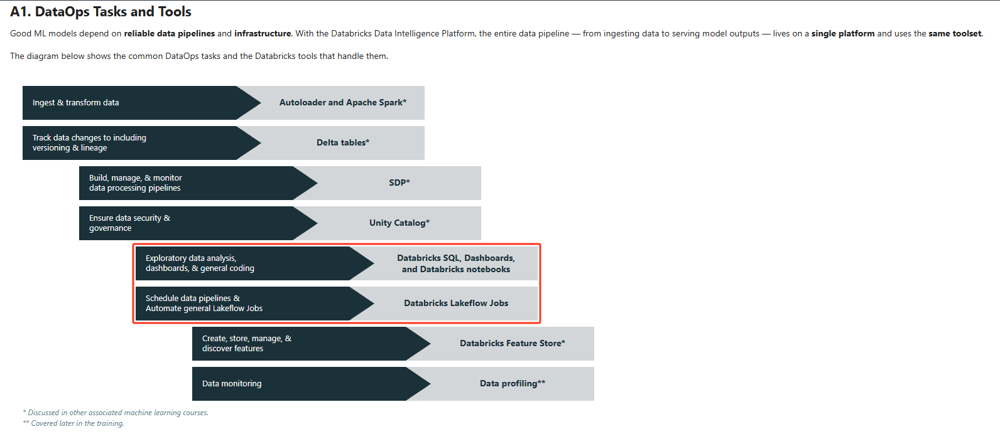
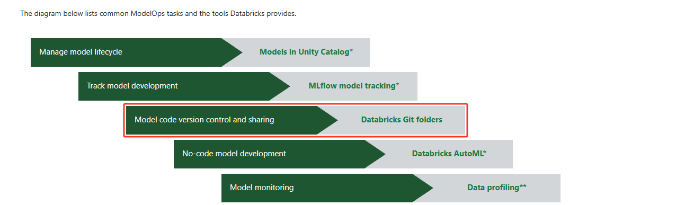

# Databricks Learning
## Lecture — MLOps on Databricks
### Overview
The previous lecture defined MLOps as the practice of managing data, code, and models across the machine learning lifecycle, built from three components: DataOps, DevOps, and ModelOps. This lecture shows how the Databricks Data Intelligence Platform delivers each of those components — introducing the specific tasks, tools, and services that make data and ML operations efficient on a single platform.

**This lecture covers 4 sections, organized around the MLOps components:**

**A. DataOps on Databricks.** The common DataOps tasks and the tools that handle them — including Databricks SQL for analytics on the freshest data, and the analyst experience of query editor, dashboards, and alerts. 
**B. Orchestration with Lakeflow Jobs.** Databricks Lakeflow Jobs as the fully-managed task orchestration service — how it compares to SDP, its key features, and the building blocks of a job (tasks, control flows, and triggers). 
**C. ModelOps on Databricks.** The common ModelOps tasks and the tools that manage the model lifecycle — plus Git folders as a visual Git client within Databricks for version control and collaboration on ML projects. 
**D. DevOps on Databricks.** Automating deployment and operations — developer tooling (CLI, SDKs, REST API, Terraform provider) and Declarative Automation Bundles (DABs) as YAML-configured Infrastructure as Code, deployed across dev, staging, and production. 
Learning Objectives
By the end of this lecture, you will be able to:  

Identify common DataOps tasks and the Databricks tools that support them, including Databricks SQL.
Describe Databricks Lakeflow Jobs and the building blocks used to orchestrate work.
Identify common ModelOps tasks and the Databricks tools that manage the model lifecycle, including the role of Git folders in ML projects.
Explain how Databricks supports DevOps through developer tools and Declarative Automation Bundles.
## A. DataOps on Databricks
### A1. DataOps Tasks and Tools
Good ML models depend on reliable data pipelines and infrastructure. With the Databricks Data Intelligence Platform, the entire data pipeline — from ingesting data to serving model outputs — lives on a single platform and uses the same toolset.

The diagram below shows the common DataOps tasks and the Databricks tools that handle them.

Ingest & transform data --> Autoloader and Apache Spark*  
Track data changes to including versioning & lineage --> Delta tables* 
    Build, manage, & monitor data processing pipelines --> SDP*  
    Ensure data security & governance  --> Unity Catalog*  
Exploratory data analysis,
dashboards, & general coding  --> Databricks SQL, Dashboards,and Databricks notebooks 
Schedule data pipelines & Automate general Lakeflow Jobs
Databricks Lakeflow Jobs  
Create, store, manage, &
discover features
Databricks Feature Store* 
Data monitoring
Data profiling**
* Discussed in other associated machine learning courses.
** Covered later in the training.
Learn more: DataOps tasks and tools in Databricks.
Documentation →
Several tools — Autoloader, Delta tables, SDP, Unity Catalog, and Feature Store — are covered in depth in other associated machine learning courses.
A2. Databricks SQL
Databricks SQL is a serverless data warehouse on the Databricks platform that lets you run all your SQL and BI applications at scale — delivering analytics on the freshest data with data warehouse performance and data lake economics.

Built on the lakehouse architecture and governed by Unity Catalog, it ensures consistency in security and compliance while connecting to the BI tools analysts already use.

Better price / performance than other cloud data warehouses.
Simplify discovery and sharing of new insights.
Connect to familiar BI tools, like Tableau or Power BI.
Simplified administration and governance.
Info
Databricks SQL is designed for large-scale ETL, real-time analytics, and machine learning workflows. Materialized views can significantly boost query speed and lower costs for data-heavy workloads. Databricks SQL integrates with popular BI tools and supports advanced analytics, making it a versatile platform for both analysts and engineers. See BI and visualization partners.
A3. A New Home for Data Analysts
Databricks SQL makes it easier for analysts to quickly visualize and share insights with a new, easy-to-use SQL query editor, rich dashboards, and automatic alerts.

Perform ad-hoc and exploratory data analysis with a new SQL query editor, visualizations, and dashboards.
Automatic alerts can be triggered for critical changes, allowing teams to respond to business needs faster.
The query editor is SQL-native: analysts write queries in a familiar syntax, explore Delta Lake table schemas, save frequently used code as snippets, and cache results to keep run times short. Results organize into dashboards via an intuitive drag-and-drop interface, and dashboards can be shared in a web browser, auto-refreshed, and configured to alert on meaningful changes.

Info
Databricks SQL empowers analysts to extend their workflows with input widgets for parameterization, User-Defined Functions (UDFs) in SQL and Python, and AI Functions that leverage large language models (LLMs) directly in SQL queries. These features enable dynamic, interactive dashboards and advanced analytics. Explore the built-in SQL functions for even more capabilities.
B. Orchestration with Lakeflow Jobs
B1. What Are Databricks Lakeflow Jobs
Databricks Lakeflow Jobs is a fully-managed, cloud-based, general-purpose task orchestration service for the entire platform. It is the service for data engineers, data scientists, and analysts to build reliable data, analytics, and AI Lakeflow Jobs on any cloud.

Because Lakeflow Jobs sits on top of the Databricks platform, it can orchestrate any combination of tasks — notebooks, SQL, Spark, ML models, and Python code — and integrate with data governance and monitoring services.

Info
Lakeflow Jobs is fully managed—no infrastructure setup or maintenance required. You can quickly build, run, monitor, and repair data pipelines, orchestrating tasks like data ingestion, transformation, and analytics. This enables teams to focus on workflow logic and outcomes, not operational overhead.
B2. Two Orchestration Services — Jobs and SDP
Databricks has two main task orchestration services: Lakeflow Jobs and SDP (Spark Declarative Pipelines). This lecture focuses on Lakeflow Jobs; SDP is covered in other machine learning content.

Service	Purpose	Typical Tasks
Lakeflow Jobs	Orchestrate any combination of tasks — more flexible	Orchestration of dependent jobs, machine learning tasks, arbitrary code, external API calls, custom tasks (notebooks, JARs, SDP pipelines, Python, Scala, Spark, SQL, Java)
SDP	Build batch and streaming data pipelines with built-in quality controls	Data ingestion and transformation — ETL processes, batch and streaming inputs, enforced data quality and consistency, tracking & logging of transformations
Info
Lakeflow Jobs and SDP are complementary orchestration services in Databricks.
Lakeflow Jobs can orchestrate any task type, including running SDP pipelines as tasks.
SDP specializes in building reliable, quality-controlled batch and streaming data pipelines.
Use Lakeflow Jobs for flexible orchestration across ML, analytics, and custom workloads; use SDP for robust ETL and data quality. Integrating both lets you build end-to-end workflows on a single platform.
B3. Lakeflow Jobs — Key Features
Lakeflow Jobs simplifies orchestration through a user-friendly interface and streamlined configuration, scheduling, and management using Directed Acyclic Graphs (DAGs) — enabling easy creation, scheduling, and orchestration of your code.

Feature	What it means
Simplicity	Easy creation and monitoring in the UI
Many Tasks	Many task types suited to your workload
Fully integrated	Built into the Databricks platform, making inspecting results and debugging faster
Reliability	Proven Databricks scheduler, with built-in task retry and failover
Observability	Easily monitor status, track performance, and gain insights into job execution
Info
Directed Acyclic Graphs (DAGs) in Lakeflow Jobs help you organize complex workflows by breaking them into smaller, manageable tasks. You can define dependencies so tasks run in sequence or in parallel, making it easier to monitor, troubleshoot, and optimize your data and ML pipelines. This structure improves reliability and clarity for both simple and large-scale processes.
B4. Building Blocks of a Lakeflow Job
A unit of orchestration in Databricks Lakeflow Jobs is called a Job. Every job is assembled from three building blocks: tasks, control flows, and triggers.

**Tasks**(Jobs consist of one or more tasks)  
- Databricks notebooks
- Python scripts
- Python wheels
- SQL files/queries
- Lakehouse dashboards
- SDP pipelines
- dbt
- Java JAR files
- Spark Submit  
**Control Flows**(Established between tasks)
- Sequential
- Parallel
- Conditionals (Run If)
- Jobs as a Task (Modular)  
**Triggers**(Jobs support different triggers)
- Manual
- Scheduled (Cron)
- API
- File Arrival
- Delta Table Update
- Continuous (Streaming)  
**Info**
Lakeflow Jobs are highly flexible: you can orchestrate many task types, define custom control flows, and trigger jobs based on schedules, APIs, or data events. This enables automation of complex workflows and ensures your pipelines respond dynamically to business needs and new data.
C. ModelOps on Databricks
C1. ModelOps Tasks and Tools
ModelOps in Databricks streamlines the lifecycle management of machine learning models — from development to deployment and monitoring. Databricks' offerings support models that are not only developed with precision but also maintained effectively throughout their operational life.

The diagram below lists common ModelOps tasks and the tools Databricks provides.

Manage model lifecycle
Models in Unity Catalog*
Track model development
MLflow model tracking*
Model code version control and sharing
Databricks Git folders
No-code model development
Databricks AutoML*
Model monitoring
Data profiling**

* Discussed in other associated machine learning courses.
** Covered later in the training.
Learn more: ModelOps tasks and tools in Databricks.
Documentation →
Models in Unity Catalog, MLflow tracking, and data profiling are explored in depth in other machine learning courses in this training.
C2. Git Folders
Git folders provide a visual Git client and API within Databricks, allowing users to manage code repositories, collaborate, and integrate with Git services. Notebooks and directories in the remote repository sync back to the workspace.

Seamless Git integration
Easily connect and manage repositories from popular Git providers, integrated directly within Databricks for a unified experience.
Collaborative coding environment
Develop code in notebooks or other files collaboratively, and use Git for version control and CI/CD.
Simplified version control
Maintain a history of changes and use visual tools for comparing changes and managing branches.
Note
Git folders in Databricks provide seamless branching, commit comments, and direct integration with your remote repository. This enables you to easily push changes, collaborate, and trigger CI/CD workflows—bringing the full power of Git version control and collaboration directly into your Databricks workspace.
C3. Git Folder Setup and Commands
Once set up, you can easily manage and perform common Git operations within Databricks. Authentication uses a Personal Access Token (PAT) or an equivalent credential to authenticate with your Git provider.

Common Git operations from the Databricks UI:

Clone
Checkout
Commit
Push
Pull
Branch management
Cloud Git Providers	On-Premises Git Providers
GitHub, GitHub AE, and GitHub Enterprise Cloud	GitHub Enterprise Server
Atlassian BitBucket Cloud	Atlassian BitBucket Server and Data Center
GitLab and GitLab EE	GitLab Self-Managed
Microsoft Azure DevOps (Azure Repos)	Microsoft Azure DevOps Server
AWS CodeCommit	 
Learn more: See the full list of supported Git providers.
Documentation →
Git folders provide a visual comparison of diffs when committing and add a simple UI for connecting to a remote Git repository, enabling project-level control over Databricks notebooks.
D. DevOps on Databricks
D1. DevOps Tasks and Tools
DevOps within Databricks focuses on enhancing the collaboration, automation, and monitoring of software development processes — streamlining the lifecycle of data analytics and machine learning applications by blending practices and tools that accelerate development cycles while ensuring high-quality, stable deployments.

Data and model lineage
Access control and governance
Unity Catalog*
Maintain a highly available
low latency REST endpoint
Databricks Model Serving*
Automate and schedule
Lakeflow Jobs, from: ETL to
ML
Databricks Lakeflow Jobs
Databricks supports integrations with popular
third party orchestrators like Airflow.
Deployment infrastructure for
inference and serving
Declarative Automation Bundles, Databricks SDKs,
Terraform provider, Databricks CLI
Establish CI/CD Pipelines
Declarative Automation Bundle, Azure
DevOps, Jenkins, or GitHub Actions
Monitoring, and Maintaining
your Applications
Data profiling**
* Discussed in other associated machine learning courses.
** Covered later in the training.
Learn more: DevOps tasks and tools in Databricks.
Documentation →
The sections that follow look at the DevOps building blocks in detail — Git folders, developer tools, and Declarative Automation Bundles.
D2. Overview of Developer Tools
Beyond the UI, Databricks provides a set of developer tools for automating and programmatically interacting with the platform.

👉 Click each tool below to learn more about it.

Note
The Terraform Provider for Databricks enables you to manage Databricks workspaces and related cloud infrastructure as code. Using Terraform ensures consistent, repeatable deployments and simplifies automation of your Databricks resources.
D3. What Is a DAB?
A Declarative Automation Bundle (DAB), also called a bundle, is Databricks' approach to Infrastructure as Code (IaC) — using a code-centric approach to manage and deploy Databricks resources.

DABs are a collection of Databricks artifacts (e.g. jobs, ML models, SDP pipelines, and clusters) and assets (e.g. Python files, notebooks, SQL queries, and dashboards).
These bundles are configured through YAML files and can be co-versioned in the same repository as the assets and artifacts they reference.
Using the Databricks CLI, bundles can be materialized across multiple workspaces (dev / staging / production), enabling teams to integrate them into their automation and CI/CD processes.
Key Takeaway
Declarative Automation Bundles (DABs) are essential for reliable, scalable Databricks deployments.
DABs use YAML to standardize and version both code and infrastructure, supporting compliance and auditability.
Teams can quickly iterate, update, and roll back deployments across dev, staging, and production workspaces.
Custom bundle templates enforce organizational standards and enable seamless CI/CD integration.
Conclusion
In this lecture, you saw how the Databricks Data Intelligence Platform delivers each component of MLOps:

DataOps on Databricks — A single platform and toolset handles the full data pipeline: Autoloader and Apache Spark for ingestion, Delta tables for versioning, SDP for pipelines, Unity Catalog for governance, and Feature Store for features. Databricks SQL provides a serverless data warehouse and a home for data analysts with a SQL query editor, dashboards, and automatic alerts.
Orchestration with Lakeflow Jobs — Databricks Lakeflow Jobs is a fully-managed, general-purpose orchestration service. It is one of two orchestration services (alongside SDP), uses DAGs for reliability and observability, and assembles every job from three building blocks: tasks, control flows, and triggers.
ModelOps on Databricks — The model lifecycle is managed with Models in Unity Catalog, MLflow model tracking, and data profiling. Git folders serve as a visual Git client within Databricks, enabling version control and collaboration directly on ML projects.
DevOps on Databricks — Deployment and operations are automated through developer tools (CLI, SDKs, REST API, Terraform provider) and Declarative Automation Bundles (DABs) — YAML-configured, co-versioned Infrastructure as Code deployed via the Databricks CLI across dev, staging, and production.
© 2026 Databricks, Inc. All rights reserved. Apache, Apache Spark, Spark, the Spark Logo, Apache Iceberg, Iceberg, and the Apache Iceberg logo are trademarks of the Apache Software Foundation.

Privacy Policy | Terms of Use | Support